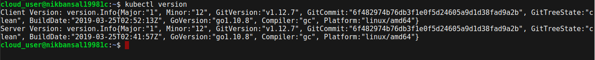

# Building a Kubernetes Cluster
This repository acts as a guide to build a Kubernetes Cluster of 3 nodes with Kubeadm.


<h2> Attribution </h2>
Hello everyone, you are welcome to make use of this guide and learn from it but please do not copy without giving attribution to the author.

<h2> Let's Start the Guide </h2>
Kubernetes (K8s) is an open-source system for automating deployment, scaling, and management of containerized applications. It automates the application infrastructure and make it easy to manage it. Kubernetes is all about managing containers. Hope you know well about containers like what they are, how they are more efficient and faster than virtual machines. Go and have a look on the basics of containers before starting to build your K8s cluster.

Docker is the container runtime we will be using. A container runtime is the software that actually runs the containers. Kubernetes supports several other container runtimes such as rkt and containerd but Docker is the most popular.

The first step in building the cluster is to install Docker(container runtime) on 3 servers. You will be requiring 3 Ubuntu servers to build a Kubernetes cluster.
One server will act as a master node and other 2 servers as worker nodes.
First install Docker on master node.
<h3> Installing Docker </h3>
<h4>1. Add the Docker repository GPG key </h4>

```javascript
curl -fsSL https://download.docker.com/linux/ubuntu/gpg | sudo apt-key add -
```

<h4>2. Add the Docker repository </h4>

```javascript
sudo add-apt-repository \
   "deb [arch=amd64] https://download.docker.com/linux/ubuntu \
   $(lsb_release -cs) \
   stable"
```

<h4> 3. Update the system </h4>
It is advisable to run this before installing any package and necessary to run it to install the latest updates.

```javascript
sudo apt-get update
```

<h4> 4. Install Docker </h4>

```javascript
sudo apt-get install -y docker-ce=18.06.1~ce~3-0~ubuntu
```

<h4> 5. Prevent auto-updates for the Docker package </h4>

```javascript
sudo apt-mark hold docker-ce
```


Now, verify whether the Docker is working or not by running this command
```javascript
sudo docker version
```


If you are able to see the above information after running <b>sudo docker version</b> command then you have successfully installed Docker on the master node and your Docker is up and running.

<b>Note:</b>
Repeat the same commands of installing Docker on both the worker nodes as you did on master node. After installing Docker on both the worker nodes, make sure to verify the docker is working or not. I am not showing here because it is the same process.

<h3> Installing Kubeadm, Kubelet, and Kubectl </h3>
Now that Docker is installed, we are ready to install the Kubernetes components.

* <b>Kubeadm</b> - This is a tool which automates a large portion of the process of setting up a cluster.

* <b>Kubelet</b> - The essential component of K8s that handles running containers on a node. Every server that will be running containers needs kubelet.

* <b>Kubectl</b> - Command line tool for interacting with the cluster once it is up. kubectl is used to manage the cluster.

Let's install kubeadm, kubelet and kubectl on all three servers.
<h4> 1. Add the Kubernetes repository GPG key </h4>

```javascript
curl -s https://packages.cloud.google.com/apt/doc/apt-key.gpg | sudo apt-key add -
```

<h4> 2. Add the Kubernetes repository </h4>

```javascript
cat << EOF | sudo tee /etc/apt/sources.list.d/kubernetes.list
deb https://apt.kubernetes.io/ kubernetes-xenial main
EOF
```

<h4> 3. Update the system </h4>

```javascript
sudo apt-get update
```

<h4> 4. Install Packages </h4>

```javascript
sudo apt-get install -y kubelet=1.12.7-00 kubeadm=1.12.7-00 kubectl=1.12.7-00
```

<h4> 5. Prevent auto-updates for the Kube packages </h4>

```javascript
sudo apt-mark hold kubelet kubeadm kubectl
```

After installing these components, verify that kubeadm is working properly. You can verify using

```javascript
kubeadm version
```


<b>Note:</b>
Repeat the same commands of installing Kubelet, Kubectl and Kubeadm on both the worker nodes as you did on master node. After installing these components on both the worker nodes, make sure to verify that kubeadm is working or not. I am not showing here because it is the same process.

<h3> Bootstrapping the Cluster </h3>

<h4> 1. Initialize the Cluster </h4>
Intializing the cluster command should only be run on master node. This command will take few minutes to complete. Make sure not to clear the screen after running this command.

```javascript
sudo kubeadm init --pod-network-cidr=10.244.0.0/16
```


The special pod network cidr is a setting that will be used later for the flannel networking plugin.

<h4> 2. Setting up the local kubeconfig </h4>
When you have ran the above command, the output displayed at the end will look something like this.


Some commands will be displayed under "To start using the cluster, you need to run the following as a regular user". Execute them on the master node.

```javascript
mkdir -p $HOME/.kube
```


```javascript
sudo cp -i /etc/kubernetes/admin.conf $HOME/.kube/config
```


```javascript
sudo chown $(id -u):$(id -g) $HOME/.kube/config
```


<h4> 3. Verify that the cluster is responsive and that Kubectl is working </h4>

```javascript
kubectl version
```


<h4> 4. Joining the other worker nodes with the master node to form a cluster </h4>
The output of the kubeadm init command i.e. output of the first step of bootstrapping the cluster contains a kubeadm join command. Copy that command and run it with sudo on both the worker nodes. Kubeadm command looks something like this:

```javascript
sudo kubeadm join $some_ip:6443 --token $some_token --discovery-token-ca-cert-hash $some_hash
```
Executing kubeadm join command on both worker nodes

1st worker node:


2nd worker node:


<h4> Verifying the nodes in the cluster </h4>

Now let's verify that our cluster is setup properly. From the master node, get a list of nodes with kubectl

```javascript
kubectl get nodes
```

The nodes will be in NotReady status until we setup networking. So lets set up the networking.

<h3> Configuring Networking with Flannel </h3>

Kubernetes supports the variety of networking solutions to provide networking between containers. We will be using <b>Flannel</b>. You can find more information on Flannel at the official site: https://coreos.com/flannel/docs/latest/.

<b>Note:</b> Down below I have written that which command must be run on which node so make sure you do the same.

<h4> 1. On all the three nodes i.e. master node and two worker nodes run the following command </h4>

```javascript
echo "net.bridge.bridge-nf-call-iptables=1" | sudo tee -a /etc/sysctl.conf
```


```javascript
sudo sysctl -p
```


I have shown only for master node as it will be the same process when done on other worker nodes.
<h4> 2. Install Flannel in the cluster by running this only on the Master node </h4>

On the master node, use kubectl to install Flannel using a YAML template

```javascript
kubectl apply -f https://raw.githubusercontent.com/coreos/flannel/bc79dd1505b0c8681ece4de4c0d86c5cd2643275/Documentation/kube-flannel.yml
```


<h4> 3. Verify that all the nodes now have a Ready status </h4>

```javascript
kubectl get nodes
```


<b>Note:</b> It may take a few moments for all nodes to enter the Ready status, so if they are not all Ready, wait a few moments and try again.

<h4> 4. It is good to check the flannel pods are up and running or not </h4>

Run this command to get a list of pods present in kube-system namespace. You will see that you have three pods of flannel and make sure they are all up and running.

```javascript
kubectl get pods -n kube-system
```


